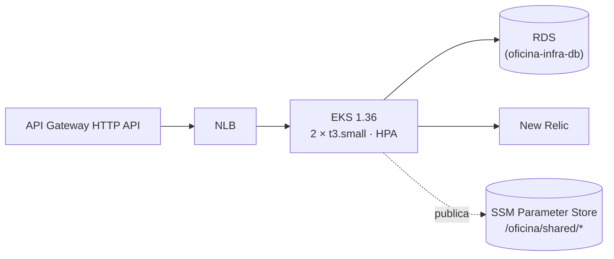

# oficina-infra-k8s

> Infraestrutura de plataforma da oficina na AWS: rede, cluster Kubernetes, API Gateway e observabilidade. **Não** contém código de aplicação nem o banco de dados gerenciado (esse vive em [oficina-infra-db](https://github.com/ProblemaTheu/oficina-infra-db)).

Parte do Tech Challenge — Fase 3. Repositórios irmãos: [oficina-app](https://github.com/ProblemaTheu/oficina-app) · [oficina-lambda-auth](https://github.com/ProblemaTheu/oficina-lambda-auth) · [oficina-infra-db](https://github.com/ProblemaTheu/oficina-infra-db)

## Papel na arquitetura



Este repositório provisiona: **VPC**, **cluster EKS**, **API Gateway**, **NLB**, **Secrets Manager**, addons do cluster (`metrics-server`, agente New Relic) e os **parâmetros SSM** consumidos pelos outros repositórios.

## Tecnologias

| Tecnologia | Versão | Uso |
|---|---|---|
| Terraform | 1.15.7 | Provisionamento |
| AWS Provider | ~> 6.0 | Recursos AWS |
| Amazon EKS | 1.36 | Cluster Kubernetes (standard support até 08/2027) |
| GitHub Actions | — | `plan` em PR, `apply` no merge da `main` |

## Estrutura

```
bootstrap/    aplicado UMA vez, com backend local: bucket de state, OIDC e roles
terraform/    infraestrutura principal, com backend remoto no S3
```

### bootstrap

Cria o que precisa existir antes de qualquer outro Terraform. Já aplicado.

```bash
cd bootstrap && terraform init && terraform apply
```

Saídas: `bucket_state`, `account_id`, `roles`.

> A partir do Terraform 1.10 o backend S3 tem **lock nativo** (`use_lockfile = true`) — por isso não há tabela DynamoDB aqui.

### terraform

```bash
cd terraform && terraform init && terraform plan
```

## Contrato com os outros repositórios

Publica no SSM Parameter Store:

| Parâmetro | Consumido por |
|---|---|
| `/oficina/shared/vpc/id` | infra-db, lambda-auth |
| `/oficina/shared/vpc/subnets_privadas` | infra-db, lambda-auth |
| `/oficina/shared/eks/cluster_name` | app (CD) |
| `/oficina/shared/eks/node_sg_id` | infra-db |
| `/oficina/shared/lambda/sg_id` | infra-db, lambda-auth |
| `/oficina/{env}/apigw/id` · `/apigw/url` | lambda-auth, app |
| `/oficina/{env}/jwt/secret_arn` | app, lambda-auth |

Consome `/oficina/{env}/apigw/authorizer_id`, publicado pelo `oficina-lambda-auth`.

## Ordem de provisionamento

`bootstrap` → **infra-k8s** → infra-db → lambda-auth → infra-k8s (2ª vez, para amarrar o authorizer) → app

## Deploy

`.github/workflows/terraform.yml`:

| Evento | Role OIDC | O que faz |
|---|---|---|
| PR para `homolog` ou `main` | `gha-oficina-infra-k8s-plan` (só leitura) | `fmt`, `validate`, `plan` comentado no PR — **nunca aplica** |
| push na `main` / disparo manual | `gha-oficina-infra-k8s` | `plan` + `apply` do mesmo plan, no *environment* `prod` |

Duas roles de propósito: a de PR não consegue criar, alterar nem destruir nada, então um PR malicioso mostra no máximo um plan. A trust policy da role de apply só aceita `main` ou `environment:prod` (ver `bootstrap/main.tf`).

O *environment* `prod` é onde a aprovação obrigatória será ligada — depende de permissão de admin no repositório, ainda pendente. `gitleaks` roda em todo evento. Sem `tfsec`/`checkov` (corte 15 do plano).

A versão do Terraform do CI vem de `.terraform-version` e **precisa ser a mesma da máquina que aplicou por último**: uma versão mais antiga se recusa a ler o state.

## Dockerfile

Não aplicável — este repositório não contém código executável.

## Documentação

Planejamento, decisões e diagramas completos em [oficina-app/docs/planejamentos/fase-3](https://github.com/ProblemaTheu/oficina-app/tree/main/docs/planejamentos/fase-3).
